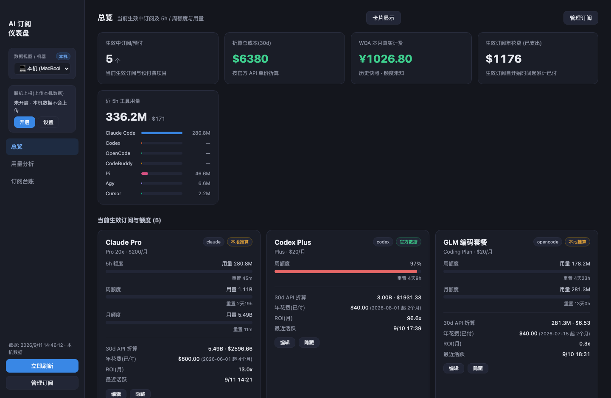
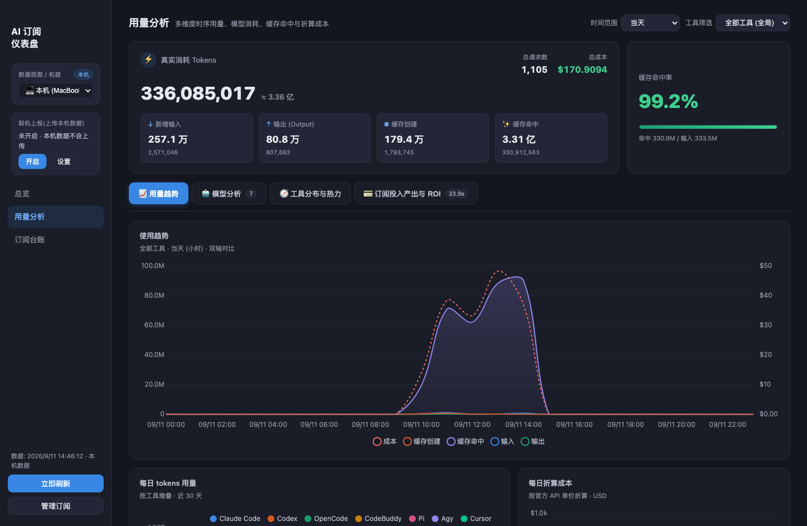
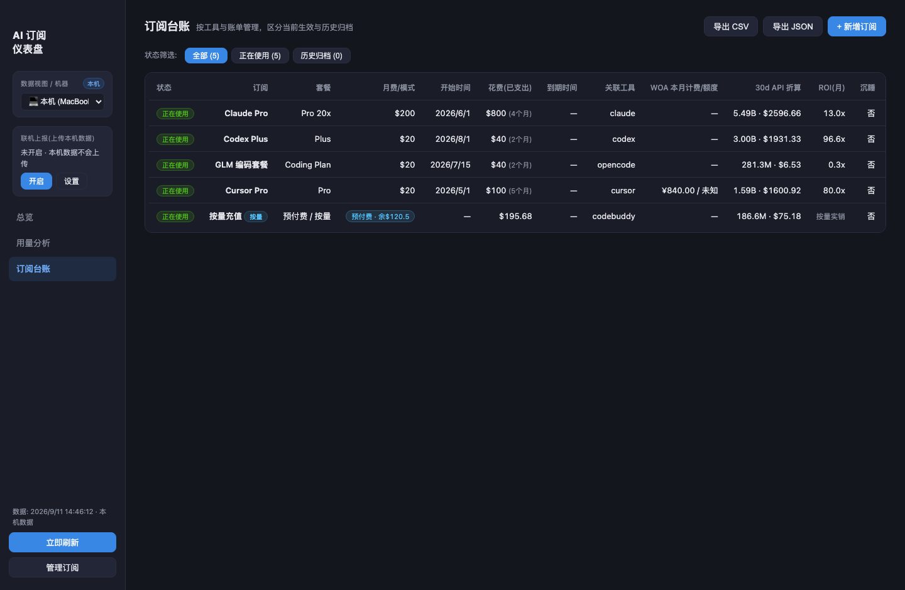

# AI Subscription Dashboard


English | [简体中文](README.md)

Unify the **usage, quota, cost and ROI** of the AI coding tools you actually pay for —
Claude Code, Codex, OpenCode, Pi, CodeBuddy, Antigravity and Cursor. Everything is read
from log files already on your machine: **no account, nothing uploaded, zero runtime
dependencies**.

## Table of contents

- [Features](#features)
- [Screenshots](#screenshots)
- [Quick start](#quick-start)
- [Pages](#pages)
- [Data sources](#data-sources)
- [Quota and cost conventions](#quota-and-cost-conventions)
- [HTTP API](#http-api)
- [Subscriptions and credentials](#subscriptions-and-credentials)
- [Optional: Hub mode (server + clients)](#optional-hub-mode-server--clients)
- [Desktop app](#desktop-app)
- [Environment variables](#environment-variables)
- [Self-tests](#self-tests)
- [Privacy and license](#privacy-and-license)

## Features

- **5h & weekly quota** — resolved as `official` (data embedded in logs) → `api` →
  `manual` → `estimate` (rolling window). It never fabricates a percentage when no real
  limit is known.
- **Coding Plan quota** — Kimi, Zhipu (personal / team), MiniMax, ZenMux, OpenCode Go and
  Volcengine Ark. Each credential is cached independently; the last good value is reused
  only after transient network failures.
- **API-equivalent cost** — unit prices from `pricingOverrides` (manual) → models.dev
  (synced) → built-in table.
- **ROI** — API-equivalent cost in the current billing cycle ÷ monthly fee.
- **Reset countdown** — remaining time for every quota window.
- **Dormant subscriptions** — highlighted after 14 days without usage.
- **Usage analytics** — 7×24 heatmap in local time, stacked bars, cost trend, per-tool
  share donut.
- **Ledger** — add / edit / archive subscriptions, export CSV or JSON.
- **Card visibility** — every stat block and subscription card can be toggled
  individually; preferences stay in the browser.

## Screenshots

**Overview** — subscription cards, 5h / weekly quota, billing period and recent usage



**Usage analytics** — stacked bars by tool, cost trend, 7×24 heatmap, share donut



**Subscription ledger** — add / edit / archive subscriptions, export CSV or JSON



> Screenshots were taken with demo subscription data so no real subscription names leak.
> The stat blocks and charts still reflect the machine's usage at capture time.

## Quick start

```bash
git clone https://github.com/Lqg97/DashboardForAI.git
cd DashboardForAI
npm start          # http://127.0.0.1:4780
```

- Requires **Node >= 22** (uses the built-in `node:sqlite`)
- Standalone mode has **zero npm dependencies** — no `npm install` needed
- The hub server additionally needs `mysql2`: run `npm install` there

## Pages

| Page | Contents |
| --- | --- |
| Overview | stat blocks, subscription cards (per billing channel), tool quota (5h / weekly) |
| Usage analytics | stacked bars / cost line / heatmap / share donut, by tool |
| Ledger | subscription table and export |

## Data sources

| Tool | Source | Notes |
| --- | --- | --- |
| claude | `~/.claude/projects/**/*.jsonl` | `message.usage` where `type=assistant` |
| codex | `~/.codex/sessions/**/rollout-*.jsonl` | diff of `token_count` events; `rate_limits.primary` is the official quota source |
| opencode | `~/.local/share/opencode/opencode.db` | `message` table; `providerID` separates opencode / codebuddy |
| pi | `~/.pi/agent/sessions/**/*.jsonl` | `message.usage`; provider prefix and `:variant` stripped |
| agy | `~/.gemini/antigravity-cli` | Antigravity CLI (Gemini); protobuf `gen_metadata` in the conversation DB, with input / output / cached-prefix tokens; timestamps aligned with `transcript.jsonl`, project taken from the workspace path |
| cursor | Cursor local state DB | observed requests and models; it does **not** invent a 500-request quota |
| manual | `data/config.json` | managed from the ledger UI, including hand-entered quota |

## Quota and cost conventions

**Quota windows** are resolved as `official` → `api` → `manual` → `estimate`. A
percentage is only computed when an official value or an explicit limit is configured;
otherwise the limit is reported as unknown.

**Pricing** comes from `https://models.dev/api.json`, fetched in the background on
startup (24h TTL, falling back to cache then a built-in table). Only text models are
kept, preferring the canonical provider and de-duplicating by `normalizedId`. Models
without a price appear in the snapshot's `unpricedModels` and can be filled in via
`pricingOverrides` in `config.json`.

**Attribution**: subscriptions link to tools through `agentIds`, and local logs can be
narrowed with an optional `modelFilter`. If two subscriptions cover the same tool without
mutually exclusive filters, usage may be attributed to both — treat it as an estimate,
not an official cost split.

## HTTP API

- `GET /api/agents` — snapshot (cached)
- `POST /api/refresh` — rescan now
- `GET|PUT /api/config` — subscription config (atomic write, 400 on validation failure)
- `GET /api/export?format=csv|json` — export

## Subscriptions and credentials

Subscriptions are managed from the **Manage subscriptions** dialog and stored in
`data/config.json` (git-ignored; the repo ships a credential-free
`data/config.example.json`).

Credential rules: Zhipu uses the raw API key (no `Bearer` prefix) and its team plan also
needs Organization ID and Project ID; Volcengine Ark quota lookup uses control-plane
AK/SK rather than the inference API key; ZenMux needs its quota endpoint as the Base URL.

**Card visibility**: toggle any stat block or subscription card from the **Card display**
dialog on the Overview page. Preferences live in `localStorage` under
`ai-sub-dashboard.cards.v1`, are never uploaded, and apply to both standalone and hub
dashboards. The **Hide** button on a card is a shortcut; restore it from the dialog.

## Optional: Hub mode (server + clients)

```text
Client (each machine)                         Hub server
┌──────────────────────────┐   POST /api/report   ┌────────────────────────┐
│ local collection         │ ───────────────────> │ MySQL: user_reports     │
│ server/client.js         │   every 5 min        │        report_history   │
└──────────────────────────┘                      └──────────┬─────────────┘
                              browser <──────────────────────┘
                              personal link sees only your own data
```

- **Hub** stores the latest snapshot plus report history keyed by user and serves the UI.
  Without MySQL configured it falls back to file storage under `DATA_DIR/users/`.
- **Client** reuses the standalone collector, reports on an interval (default 5 min) and
  rescans immediately when asked. **Credentials stay on the client** — the uploaded
  snapshot contains no secrets.
- **Reporting is opt-in** and can be turned off at any time from the tray menu, the
  sidebar card or the CLI.
- **Per-user isolation** — each user opens their own link
  `http://<hub>:<port>/?user=<userId>&token=<HUB_TOKEN>`; the Hub persists the identity in
  an HttpOnly cookie and every data endpoint returns only that user's data. A mismatched
  token is rejected with 401.
- **Admin view** — with `HUB_ADMIN_TOKEN`, `?admin=<token>` shows all users aggregated.

### Quick start (hub)

```bash
# Server: deploy the Hub + MySQL container (idempotent; prints tokens on first run)
bash scripts/deploy-hub.sh

# Client (on each machine)
HUB_URL=http://<hub>:4780 DASH_TOKEN=<HUB_TOKEN> npm run client
# one-shot report:
node server/client.js --once
```

### Hub API

| Endpoint | Description |
| --- | --- |
| `POST /api/report` | client reports `{userId, machine, token?, snapshot}` |
| `GET /api/me` | current viewer identity and client online state |
| `GET /api/agents` | snapshot for the current user (401 if unidentified); admin sees everything merged |
| `POST /api/refresh` | ask the current user's clients to rescan (picked up within ~15s) |
| `GET /api/history` | report history for the current user |
| `GET /api/export?format=csv\|json` | export (admin export includes a `user` column) |
| `GET /api/users` | user list (admin only) |
| `POST /api/users/delete` | delete all data for a user (admin only) |

Clients report on their own schedule, so aggregated numbers are approximate.

## Desktop app

```bash
npm run app        # Electron tray icon + standalone window
```

The tray menu can toggle reporting, open settings, refresh model pricing and enable
launch at login.

> **Not signed**: there is no Developer ID certificate, so the build is ad-hoc signed and
> macOS blocks it the first time. Run once:
> `xattr -cr "/Applications/AI Sub Dashboard.app"` or right-click → Open.

## Environment variables

**Standalone**: `PORT` (4780) · `RESCAN_INTERVAL_MS` (300000) · `CLAUDE_DIR` ·
`CODEX_DIR` · `OPENCODE_DB` · `PI_DIR` · `AGY_DIR` · `DATA_DIR`

**Quota credentials**: `KIMI_API_KEY` · `ZHIPU_API_KEY` / `GLM_API_KEY` ·
`MINIMAX_API_KEY` · `ZENMUX_API_KEY` · `OPENCODE_GO_API_KEY` ·
`VOLCENGINE_ACCESS_KEY_ID` · `VOLCENGINE_SECRET_ACCESS_KEY`

**Hub server**: `HUB_PORT` (4780) · `HUB_HOST` (0.0.0.0) · `HUB_TOKEN` ·
`HUB_ADMIN_TOKEN` · `HUB_ONLINE_WINDOW_MS` (10 min) · `MYSQL_HOST` / `PORT` / `USER` /
`PASSWORD` / `DATABASE` · `HUB_HISTORY_KEEP` (288 ≈ 24h)

**Client**: `HUB_URL` · `DASH_USER` · `DASH_MACHINE` · `DASH_TOKEN` ·
`REPORT_INTERVAL_MS` (300000)

## Self-tests

```bash
npm test                    # unit tests
npm run test:coverage
npm run selftest            # collectors against real local data
node server/quota/_selftest.js
node server/insights.test.mjs
```

## Privacy and license

- All collection happens locally, from files the tools already wrote
- In hub mode the uploaded snapshot contains usage numbers and subscription metadata —
  **no API keys or credentials**
- Reporting is off until you turn it on

[GNU General Public License v3.0](LICENSE):

- You may use, modify and distribute this software, including commercially
- Any distribution (modified or not) must **also be licensed under GPL-3.0**, keeping
  copyright and license notices
- Source must be made available; the software is provided "as is", without warranty
- `public/vendor/chart.umd.min.js` (Chart.js) is MIT licensed, which is GPL-3.0
  compatible; it keeps its original notice
